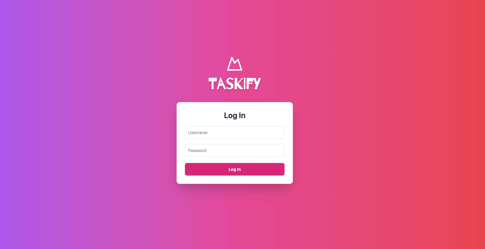

### 🖥️ To-Do List Web App — Frontend (React)

This repository contains the **web interface** for managing tasks, built using **React**. The app communicates with a Python backend via REST API.

> 🔗 Users can log in and manage their tasks. Admin users have access to user management as well.

---

## 📸 Web App Preview



---

## 🚀 Tech Stack

-   React 18+
-   React Router
-   Axios
-   Tailwind CSS
-   Integration with Python + PostgreSQL backend API

---

## 📋 Features

### 🔐 Authentication

-   User registration (default role: regular user).
-   Login with username and password
-   User roles: regular user / admin

### 📝 Task Management

-   Add, view, edit, and delete tasks
-   View task details

### 👥 User Management (Admin only)

-   View all users
-   Add users
-   Delete users
-   Modify users
-   View user's tasks

---

## 🗂️ Project Structure

```
todo_front/
├── public/
├── src/
│ ├── components/ # Reusable components
│ ├── pages/ # Route views
│ ├── services/ # API integration
│ ├── hooks/ # Custom hooks
│ ├── App.jsx
│ └── main.jsx
├── package.json
├── README.md
└── ...
```

## ⚙️ Getting Started

1. Clone the repository
   `git clone https://github.com/yuliia-martynovych/todo-front.git`
   `cd todo-front`
2. Install dependencies
   `npm install`
3. Run the app
   `npm run dev`

## 🔄 Backend API

This app communicates with the backend API located here:
👉 https://github.com/yuliia-martynovych/todo-list

## ✨ Highlights

Clean and minimal user interface
Route protection and role-based rendering
Form validation
Asynchronous data fetching with loading states

## 📜 License

MIT License
